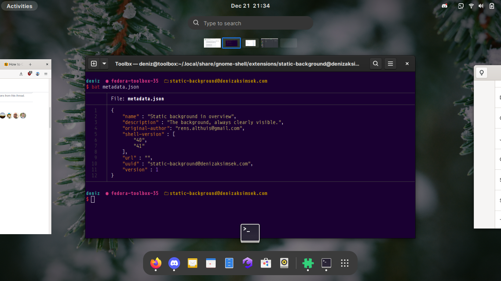

## Static Wallpaper in Overview

_a GNOME shell extension_

The code of this extension is mostly extracted from [Vertical Overview][] by
[Rens Althuis][], retrieved 2021-12-21. 

While I am used to the horizontally arranged workspaces of GNOME 40+, I quite
liked the static wallpaper feature in Vertical Overview. I often use maximized
windows on every workspace, so I don't have many chances to see my wallpaper.

Having been unable to find an extension that does that without touching the 
rest of the overview, I extracted the parts I wanted from Vertical Overview and
touched up the animations a bit to create this extension.

[Vertical Overview]: https://github.com/RensAlthuis/vertical-overview
[Rens Althuis]: https://github.com/RensAlthuis
